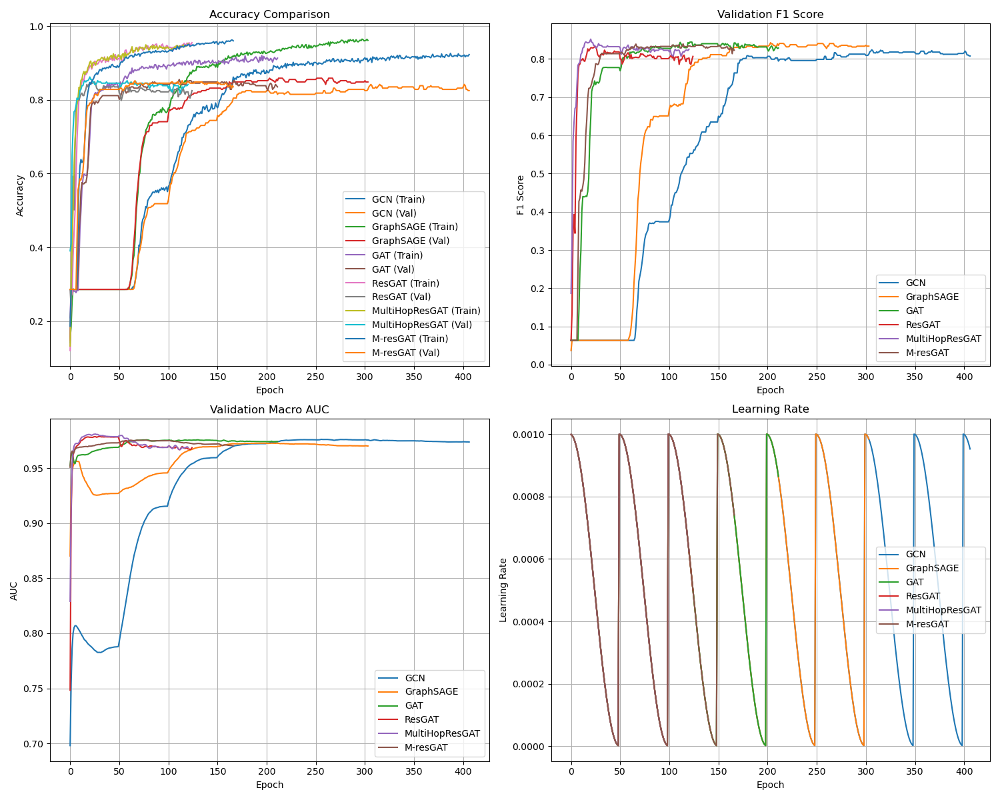
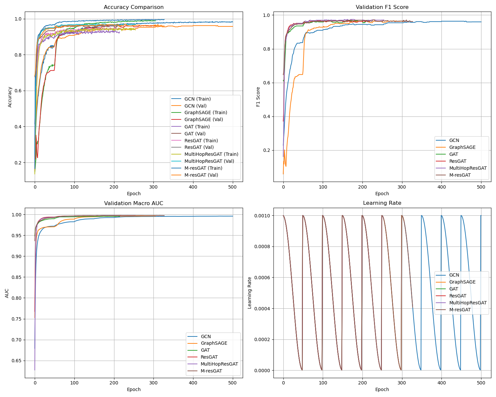
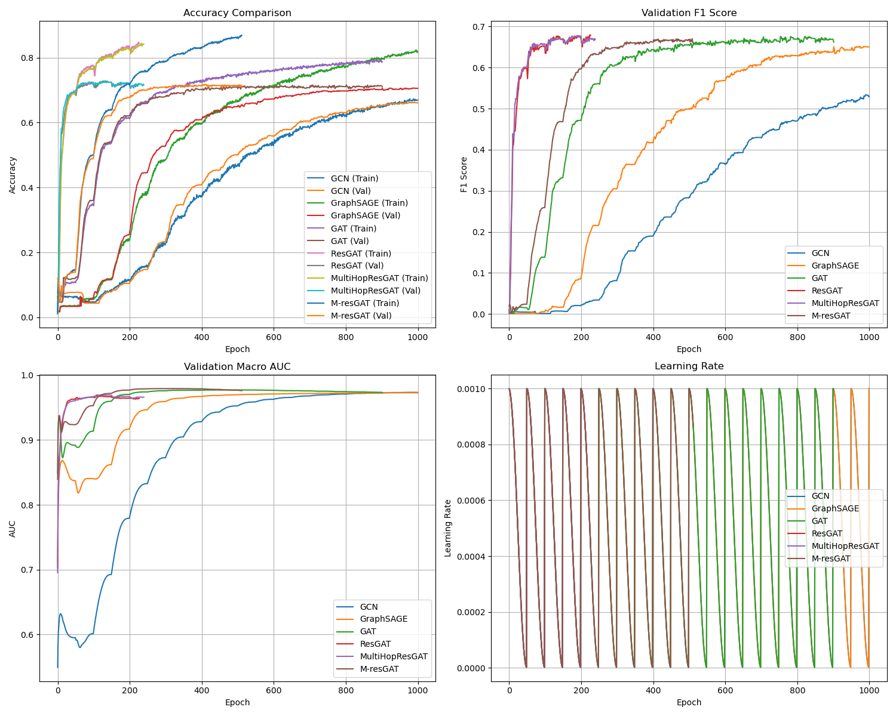

# M-ResGAT: Multi-hop Motif-based Residual Graph Attention Networks

**M-ResGAT** is a novel Graph Neural Network (GNN) architecture that extends Residual Graph Attention Networks (ResGAT) with multi-hop attention mechanisms and motif-based structural information to improve node classification performance in citation networks.


## 🚀 **Features**
- **Motif-based Patterns:** Integrates higher-order graph structures for enhanced representation.
- **Residual Connections:** Ensures better gradient flow and stability.
- **Hybrid Information Matrices:** Combines first-order and higher-order relationships.


## 📂 **Repository Structure**

```
M-ResGAT/
├── data/
│   ├── __init__.py
│   └── dataset.py
├── models/
│   ├── __init__.py
│   ├── gcn.py
│   ├── graphsage.py
│   ├── gat.py
│   ├── resgat.py
│   ├── mresgat.py
│   └── M_resgat.py
├── utils/
│   ├── __init__.py
│   ├── metrics.py
│   ├── visualization.py
├── requirements.txt
└── train.py
```

## 🔧 **Installation**

```bash
# Clone the repository
git clone https://github.com/yourusername/M-ResGAT.git
cd M-ResGAT

# Create a conda environment
conda create -n resgat python=3.8
conda activate resgat

# Install dependencies
pip install -r requirements.txt
```


## 🧑‍💻 **Usage**

### Training

```bash
# Train on a specific dataset
python train.py --datasets Cora_ML

# Train on multiple datasets
python train.py --datasets Cora_ML CiteSeer

# Train specific models
python train.py --datasets Cora_ML --models GAT ResGAT M-ResGAT

```

### Configuration

Modify `config` in train.py to adjust model parameters:
- Model architecture (hidden channels, layers, heads)
- Training parameters (learning rate, weight decay)
- Multi-hop settings (number of hops, combination method)
- Motif attention parameters (beta coefficient)


## 📊 **Evaluation Metrics**

The model's performance is evaluated using:
- Classification Accuracy
- Macro F1-Score
- Node Classification AUC


## 🎯 **Results**

### Performance on Cora-ML

| **Model**       | **Test Acc (%)**  | **Test F1**       | **Test AUC**     | **Time (s)**         |
|------------------|-------------------|-------------------|------------------|----------------------|
| GCN              | 86.12 ± 0.19      | 84.72 ± 0.31      | 98.59 ± 0.01     | 6.57 ± 1.46          |
| GraphSAGE        | 87.21 ± 0.00      | 86.30 ± 0.13      | 98.57 ± 0.03     | 4.97 ± 0.93          |
| GAT              | 87.32 ± 0.68      | 86.67 ± 0.62      | 98.58 ± 0.04     | 6.47 ± 0.40          |
| ResGAT           | 86.45 ± 0.51      | 85.44 ± 0.79      | 98.26 ± 0.06     | 2.30 ± 0.46          |
| MultiHopResGAT   | 84.37 ± 0.68      | 82.97 ± 0.76      | 97.65 ± 0.21     | 3.63 ± 1.17          |
| M-ResGAT         | 87.00 ± 0.18      | 86.42 ± 0.12      | 98.68 ± 0.01     | 14.00 ± 2.13         |

### Performance on CiteSeer

| **Model**       | **Test Acc (%)**  | **Test F1**       | **Test AUC**     | **Time (s)**         |
|------------------|-------------------|-------------------|------------------|----------------------|
| GCN              | 95.25 ± 0.27      | 95.41 ± 0.27      | 99.71 ± 0.01     | 6.87 ± 1.37          |
| GraphSAGE        | 95.95 ± 0.14      | 96.13 ± 0.15      | 99.59 ± 0.02     | 4.23 ± 0.25          |
| GAT              | 95.33 ± 0.23      | 95.50 ± 0.23      | 99.58 ± 0.05     | 6.30 ± 1.87          |
| ResGAT           | 95.41 ± 0.13      | 95.58 ± 0.14      | 99.60 ± 0.04     | 3.93 ± 0.95          |
| MultiHopResGAT   | 96.11 ± 0.13      | 96.31 ± 0.12      | 99.51 ± 0.03     | 5.83 ± 2.17          |
| M-ResGAT         | 95.33 ± 0.23      | 95.51 ± 0.25      | 99.49 ± 0.03     | 47.30 ± 9.97         |

### Performance on Cora

| **Model**       | **Test Acc (%)**  | **Test F1**       | **Test AUC**     | **Time (s)**         |
|------------------|-------------------|-------------------|------------------|----------------------|
| GCN              | 63.86 ± 0.09      | 51.30 ± 0.14      | 96.90 ± 0.00     | 120.27 ± 2.22        |
| GraphSAGE        | 68.32 ± 0.03      | 63.33 ± 0.07      | 97.10 ± 0.01     | 164.10 ± 1.48        |
| GAT              | 68.86 ± 0.12      | 63.69 ± 0.21      | 97.22 ± 0.03     | 139.07 ± 8.05        |
| ResGAT           | 68.49 ± 0.26      | 63.16 ± 0.20      | 95.78 ± 0.10     | 30.63 ± 1.15         |
| MultiHopResGAT   | 69.07 ± 0.33      | 64.00 ± 0.16      | 96.10 ± 0.19     | 37.30 ± 4.10         |
| M-ResGAT         | 68.31 ± 0.32      | 63.16 ± 0.29      | 97.31 ± 0.04     | 5247.53 ± 6.12       |

Our experimental results highlight distinct performance patterns across different evaluation metrics. On Cora-ML, M-ResGAT achieves competitive test accuracy (87.00\%) and the highest AUC score (98.68\%), while matching GraphSAGE's strong F1 performance (86.42\%). For CiteSeer, MultiHop-ResGAT demonstrates superior performance with the highest test accuracy (96.11\%) and F1 score (96.31\%), though GCN achieves the best AUC score (99.71\%). On the more challenging Cora dataset, MultiHop-ResGAT leads in both test accuracy (69.07\%) and F1 score (64.00\%), while M-ResGAT achieves the highest AUC (97.31\%). These results suggest that MultiHop-ResGAT's explicit multi-hop attention mechanism is particularly effective for capturing complex node relationships in denser networks like CiteSeer, whereas M-ResGAT's motif-based approach excels at identifying broader class-specific patterns, as evidenced by its strong AUC performance across all datasets.

### Training Dynamics
 
 
 
Both M-ResGAT and MultiHop-ResGAT demonstrate faster convergence compared to baseline models, suggesting that incorporating higher-order structural information accelerates learning across three different datasets.


## 📘 **Citation**
- Veličković, Petar, Cucurull, Guillem, Casanova, Arantxa, Romero, Adriana, Liò, Pietro, & Bengio, Yoshua. (2017). [Graph Attention Networks](https://doi.org/10.48550/arXiv.1710.10903). *arXiv*. doi:10.48550/arXiv.1710.10903.

- Debackere, Wolfgang, & Glänzel, Koenraad. (2022). [Various aspects of interdisciplinarity in research and how to quantify and measure those](https://ideas.repec.org/a/spr/scient/v127y2022i9d10.1007_s11192-021-04133-4.html). *Scientometrics*, 127(9), 5551–5569. doi:10.1007/s11192-021-04133-4.

- Nguyen-Vo, Thanh-Hoang, Do, Trang T. T., & Nguyen, Binh P. (2024). [ResGAT: Residual Graph Attention Networks for molecular property prediction](https://doi.org/10.1007/s12293-024-00423-5). *Memetic Computing*, 16(3), 491–503. doi:10.1007/s12293-024-00423-5.

- Wang, Guangtao, Ying, Rex, Huang, Jing, & Leskovec, Jure. (2020). [Multi-hop Attention Graph Neural Network](https://doi.org/10.48550/arXiv.2009.14332). *arXiv*. doi:10.48550/arXiv.2009.14332.

- Huang, Xuejian, Wu, Zhibin, Wang, Gensheng, Li, Zhipeng, Luo, Yuansheng, & Wu, Xiaofang. (2024). [ResGAT: an improved graph neural network based on multi-head attention mechanism and residual network for paper classification](https://doi.org/10.1007/s11192-023-04898-w). *Scientometrics*, 129(2), 1015–1036. doi:10.1007/s11192-023-04898-w.

- Ye, Huang ZhengWei, Min JinTao, Yang YanNi, Huang Jin, & Tian. (2022). [Recommendation method for academic journal submission based on doc2vec and XGBoost](https://ideas.repec.org/a/spr/scient/v127y2022i5d10.1007_s11192-022-04354-1.html). *Scientometrics*, 127(5), 2381–2394. doi:10.1007/s11192-022-04354-1.

- Zhang, Lin, Sun, Beibei, Shu, Fei, & Huang, Ying. (2022). [Comparing paper level classifications across different methods and systems: an investigation of Nature publications](https://doi.org/10.1007/s11192-022-04352-3). *Scientometrics*, 127(12), 7633–7651. doi:10.1007/s11192-022-04352-3.

- Zhu, Yanqiao, Xu, Yichen, Yu, Feng, Liu, Qiang, Wu, Shu, & Wang, Liang. (2020). [Deep Graph Contrastive Representation Learning](https://doi.org/10.48550/arXiv.2006.04131). *arXiv*. doi:10.48550/arXiv.2006.04131.

- You, Yuning, Chen, Tianlong, Sui, Yongduo, Chen, Ting, Wang, Zhangyang, & Shen, Yang. (2020). [Graph Contrastive Learning with Augmentations](https://www.semanticscholar.org/paper/Graph-Contrastive-Learning-with-Augmentations-You-Chen/2a9fbca9dc6badbeedc591ad829c5c6e0f950fd6). *Neural Information Processing Systems*.

- Bojchevski, Aleksandar, & Günnemann, Stephan. (2017). [Deep Gaussian Embedding of Graphs: Unsupervised Inductive Learning via Ranking](https://doi.org/10.48550/arXiv.1707.03815). *arXiv*. doi:10.48550/arXiv.1707.03815.

- Wu, Z., & Hao, J. (2024). [Electrical transport properties in group-V elemental ultrathin 2D layers](https://doi.org/10.1038/s41699-020-0139-x). *npj 2D Materials and Applications*, 4(1). doi:10.1038/s41699-020-0139-x.

- Kipf, Thomas N., & Welling, Max. (2016). [Semi-Supervised Classification with Graph Convolutional Networks](https://doi.org/10.48550/arXiv.1609.02907). *arXiv*. doi:10.48550/arXiv.1609.02907.

- Hamilton, William L., Ying, Rex, & Leskovec, Jure. (2017). [Inductive Representation Learning on Large Graphs](https://doi.org/10.48550/arXiv.1706.02216). *arXiv*. doi:10.48550/arXiv.1706.02216.

- Verma, Atul Kumar, Saxena, Rahul, Jadeja, Mahipal, Bhateja, Vikrant, & Lin, Jerry Chun-Wei. (2023). [Bet-GAT: An Efficient Centrality-Based Graph Attention Model for Semi-Supervised Node Classification](https://doi.org/10.3390/app13020847). *Applied Sciences*, 13(2), 847. doi:10.3390/app13020847.

- Kim, Dongkwan, & Oh, Alice. (2019). [Supervised Graph Attention Network for Semi-Supervised Node Classification](https://www.semanticscholar.org/paper/Supervised-Graph-Attention-Network-for-Node-Kim-Oh/431f4d7bbfdbd8add524c7c7cb4b075ad12e5827).

- Li, Xiangci, & Ouyang, Jessica. (2024). [Related Work and Citation Text Generation: A Survey](https://doi.org/10.48550/arXiv.2404.11588). *arXiv*. doi:10.48550/arXiv.2404.11588.

- Zhang, Jiasheng, Chen, Jialin, Maatouk, Ali, Bui, Ngoc, Xie, Qianqian, Tassiulas, Leandros, Shao, Jie, Xu, Hua, & Ying, Rex. (2024). [LitFM: A Retrieval Augmented Structure-aware Foundation Model For Citation Graphs](https://doi.org/10.48550/arXiv.2409.12177). *arXiv*. doi:10.48550/arXiv.2409.12177.

- Wang, Lei, Li, Zheng-Wei, You, Zhu-Hong, Huang, De-Shuang, & Wong, Leon. (2023). [MAGCDA: A Multi-Hop Attention Graph Neural Networks Method for CircRNA-Disease Association Prediction](https://doi.org/10.1109/JBHI.2023.3346821). *IEEE Journal of Biomedical and Health Informatics*, 28(3), 1752–1761. doi:10.1109/JBHI.2023.3346821.

- Deng, Ping, & Huang, Yong. (2024). [Edge-featured multi-hop attention graph neural network for intrusion detection system](https://doi.org/10.1016/j.cose.2024.104132). *Computers & Security*, 148, 104132. doi:10.1016/j.cose.2024.104132.

- Gong, Chuanyang, Wei, Zhihua, Wang, Xinpeng, Wang, Rui, Li, Yu, & Zhu, Ping. (2024). [Subgraph-Based Attention Network for Multi-Hop Question Answering](https://doi.org/10.1109/IJCNN60899.2024.10650851). *2024 International Joint Conference on Neural Networks (IJCNN)*. doi:10.1109/IJCNN60899.2024.10650851.

- Sheng, Jinfang, Zhang, Yufeng, Wang, Bin, & Chang, Yaoxing. (2024). [MGATs: Motif-Based Graph Attention Networks](https://doi.org/10.3390/math12020293). *Mathematics*, 12(2), 293. doi:10.3390/math12020293.

- Sankar, Aravind, Zhang, Xinyang, & Chang, Kevin Chen-Chuan. (2017). [Motif-based Convolutional Neural Network on Graphs](https://doi.org/10.48550/arXiv.1711.05697). *arXiv*. doi:10.48550/arXiv.1711.05697.

- Peng, Hao, Li, Jianxin, Gong, Qiran, Wang, Senzhang, Ning, Yuanxing, & Yu, Philip S. (2018). [Graph Convolutional Neural Networks via Motif-based Attention](https://doi.org/10.48550/arXiv.1811.08270). *arXiv*. doi:10.48550/arXiv.1811.08270.


## 📝 **License**

This project is licensed under the MIT License - see the [LICENSE](LICENSE) file for details.
